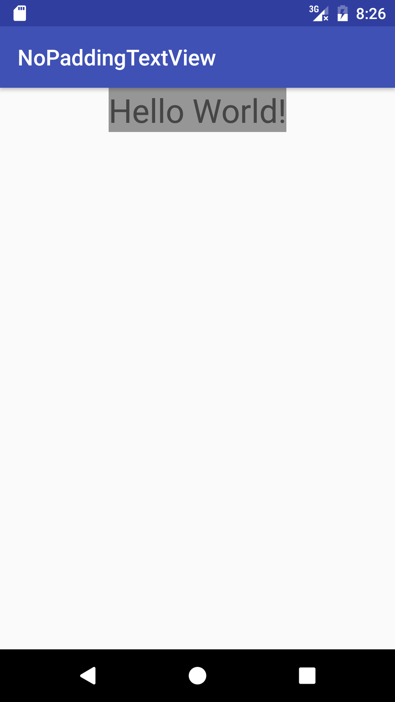
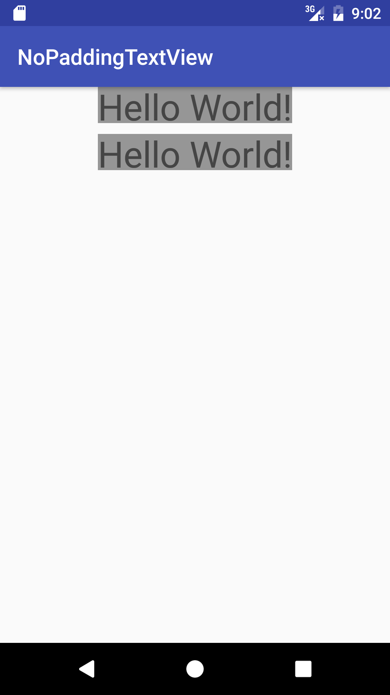
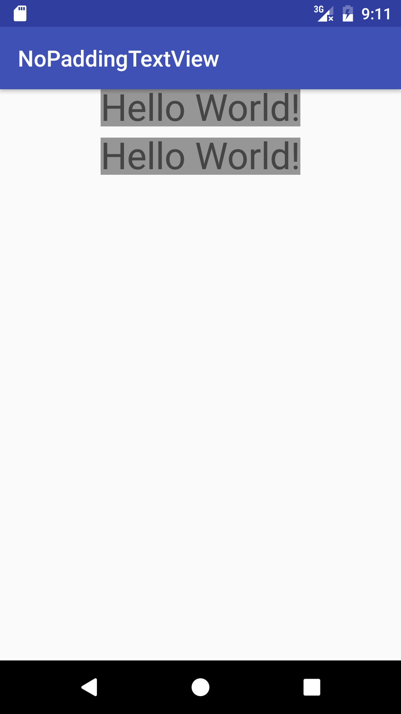

# NoPaddingTextView

有天, 当你遇到复杂的UI界面, 发现, 咦? 我的TextView明明使用的wrap_content, 明明没有设置padding, 为什么文字上下部分多出来了一块空间. 

 

那么, 问题来了, 如果有两个上下排列的TextView, 它们的文字间隔是30px(姑且使用px适配, 因为设计图上标的是px), 那么我怎么确定?  
两个上下的TextView各自wrap_content, 下面的设置MarginTop为30px? 

 

你会发现真正的文字距离不止30px, 那该怎么办呢? 于是你又准备尝试把TextView的高度设置成字体的高度, 于是乎 

 

哎呀, 字体显示不全了...  哎呀, 那个像个Padding的东西还在! 于是你就开始琢磨, 设置padding=0 不行, 设置padding<0 可以了, 然后该怎么做屏幕适配呢? 
于是你又开始去网上找, 大都无一例外, 很多人告诉你设置: android:includeFontPadding="false" 

 

嗯, 好像可以了... 不! 不够完美! 还有一点padding, 或者字体不居中...  不行, 我是强迫症, 我要去掉它! 然后你通过常规的尝试, 仍然不行. 
最后, 脑子一转, 设置不了难道我不能自定义吗? 
hey, 别了, 这条路我已经走过了, 我这有, 拿去用吧!!! 效果图如下: 

 

ps: 我已经尽力了, 高度和字体大小一样, 仍然有一点小间隔, 可能是字体大小尽管跟控件高度设置的一样, 但是实际显示字体的大小并没有完全贴边吧 